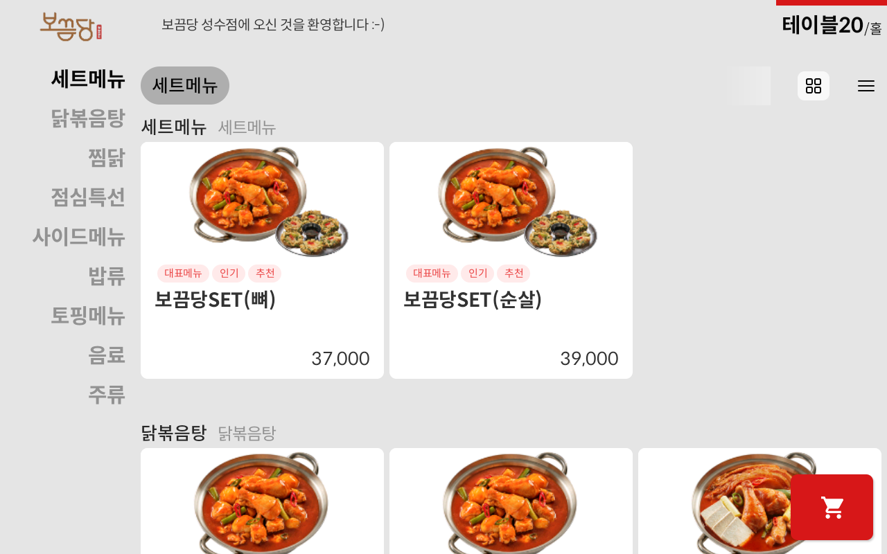
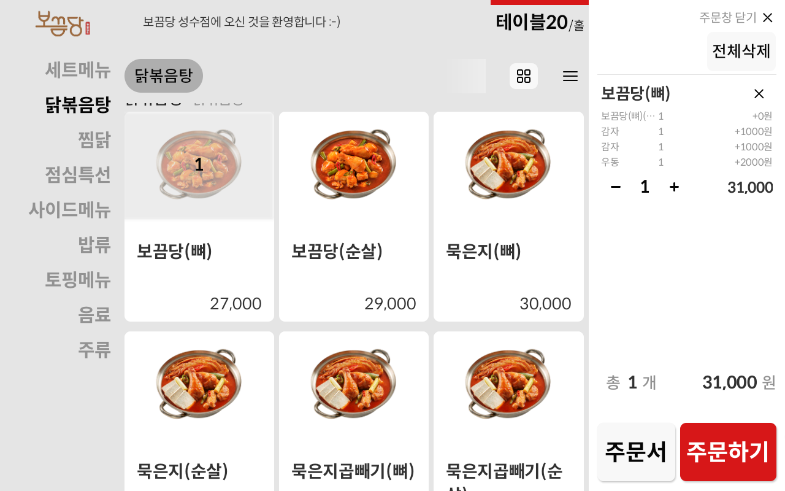

# ✅ 주문


\[주문하기] 이후 <mark style="background-color:red;">브이디메뉴로 "주문완료"</mark> 라는 로봇 이미지 화면이 노출 이후 **포스에 주문등록이 됩니다.**


<figure><figcaption>
메뉴 화면
</figcaption></figure>

 

<figure><figcaption>
메뉴 선택 > 주문하기
</figcaption></figure>

<figure><figcaption>
주문 완료
</figcaption></figure>

