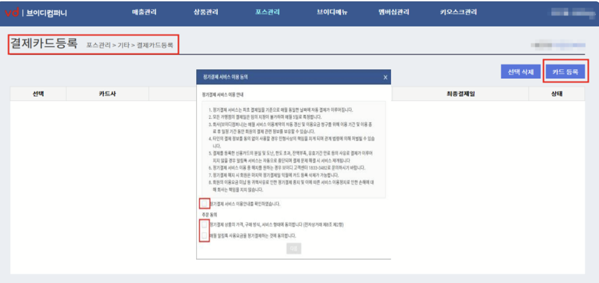

# 💳 알림톡 결제관리


카드정보알림톡 사용에 대한 정기결제를 위해 카드 등록이 필요합니다.

(웨이팅 고객에게 발송되는 <mark style="background-color:yellow;">알림톡은 유료 서비스</mark>입니다.)


## 결제카드 등록 

1. <mark style="background-color:yellow;">파트너어드민 > 포스관리 > 기타 > 결제카드 등록</mark> 화면에서 \[카드 등록]을 선택하고, 정기결제 서비스 이용에 동의하여 카드 등록을 시작합니다.

<figure><figcaption>
결제카드 등록
</figcaption></figure>

2. 자동결제 약관 및 이용동의를 확인 후 체크하고, \[다음]을 눌러 본인확인을 완료합니다.

<figure><figcaption>
동의 및 본인 확인
</figcaption></figure>

3. 결제할 카드 정보를 입력하여 카드 등록을 완료합니다.

<figure><figcaption></figcaption></figure>

<figure><figcaption>
 카드정보 입력 ( 법인 카드 )
</figcaption></figure>


&#x20;**법인카드**를 등록할 시에는 **사업자번호 항목을 선택**하여, 주민등록번호 대신 사업자번호를 입력해주세요.



**알림톡 비용 청구**

전월 알림톡 사용분을 정산하여 비용 청구 및 결제

* 2일 : 청구 대상건 취합
* 3일 : 청구 알림톡 발송
* 5일 : 자동 결제(결제실패 시 어드민에 등록된 매장 대표번호로 알림톡 발송되며, 고객센터를 통해 수동 결제 진행)



**알림톡 비용**

* 알림톡 : 건당 8원(VAT 별도)
* SMS : 건당 10원(VAT 별도)
* LMS : 건당 25원(VAT 별도)


## 알림톡 결제현황 

1. 파트너어드민 > 포스관리 > 기타 > 알림톡 결제현황 화면에서 월별 알림톡 결제내역을 확인할 수 있습니다.
2. 월 단위로 기간 선택하여 건수 조회 및 엑셀 파일 다운로드가 가능합니다.

<figure><figcaption>
알림톡 결제 현황
</figcaption></figure>

## 알림톡 사용현황 

1. <mark style="background-color:yellow;">파트너어드민 > 포스관리 > 기타 > 알림톡 사용현황</mark> 화면에서 매장에서 발송한 모든 알림톡 건수를 확인할 수 있습니다.
2. 월 단위로 기간 선택하여, 해당 기간의 일자별 건수 조회 및 엑셀 파일 다운로드가 가능합니다.

<figure><figcaption>
알림톡 사용현황
</figcaption></figure>


한 달 동안 집계된 건수 만큼 익월 등록된 카드로 결제 처리됩니다.


Was this helpful?

\
