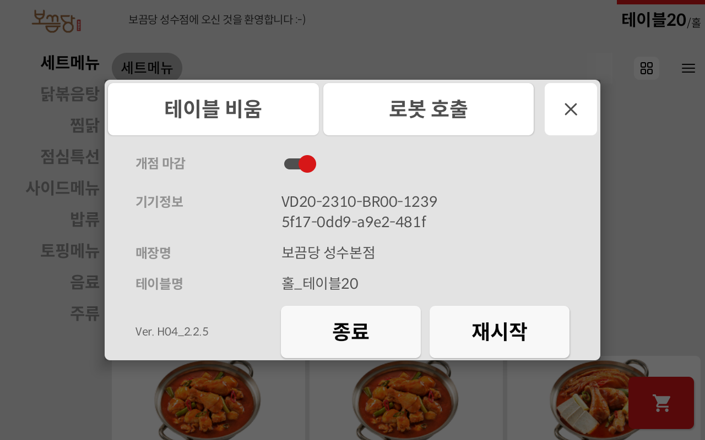
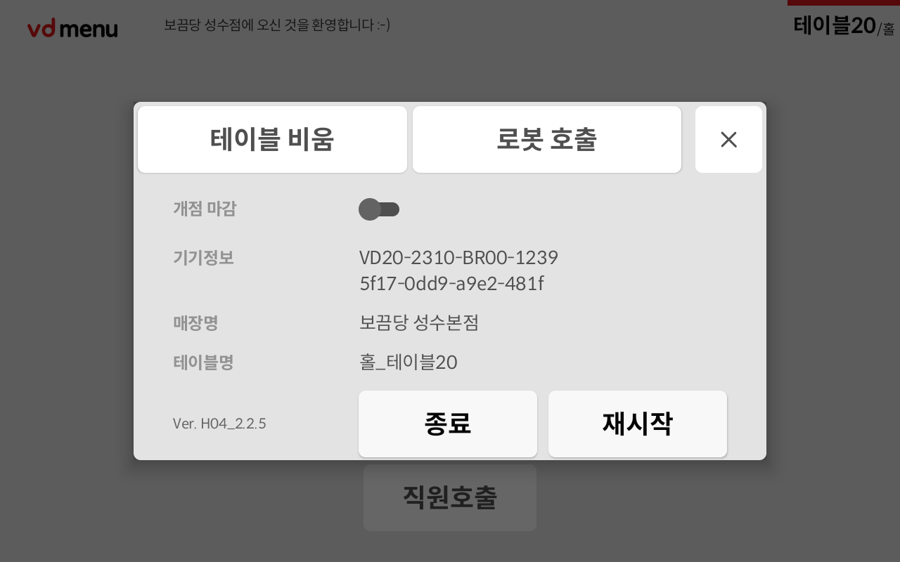

# 💡 개점/ 마감

## 1. 마스터 테블릿 통한 브이디 메뉴 개점/ 마감

* 전체  테이블  개점/ 마감 : 오른쪽 상단 "모두개점"  "모두마감"&#x20;
* 개별 테이블 개점/마감 : "개점처리"  활성화 / 비활성화


<mark style="color:red;">전력 공급이 되어 있으면 전원이 꺼지지 않습니다.</mark>&#x20;

충전기 연결을 해제한 뒤 "기기전체종료"를 눌러야 전원이 완전히 꺼집니다.&#x20;



마스터 테블릿은 추가 구매 필요합니다.


<figure><figcaption></figcaption></figure>

## 2. 브이디메뉴에서 마감하기

* 왼쪽 상단 로고 3번이상 터치&#x20;
* "개점마감" 비활성화

<figure><figcaption></figcaption></figure>

 

<figure><figcaption></figcaption></figure>

